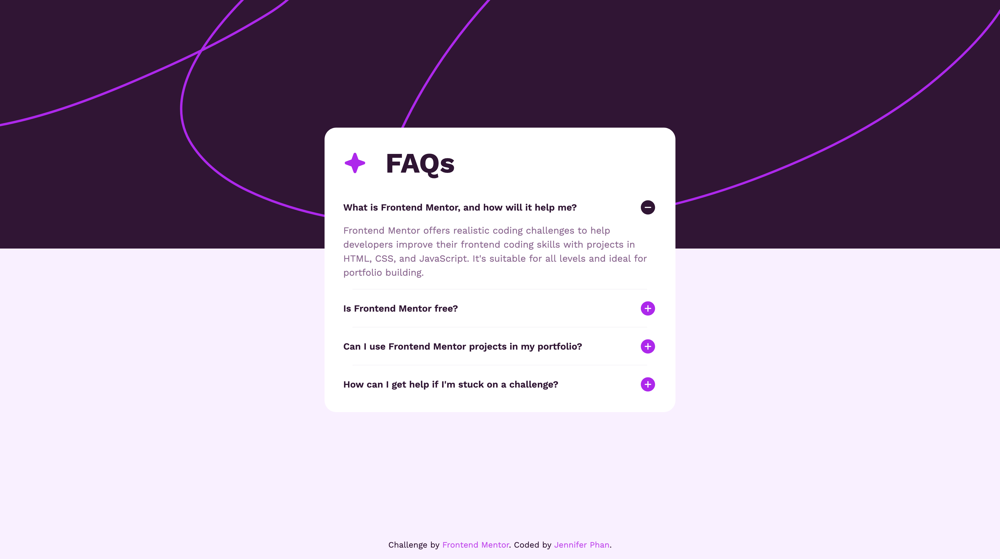

# Frontend Mentor - FAQ accordion solution

This is a solution to the [FAQ accordion challenge on Frontend Mentor](https://www.frontendmentor.io/challenges/faq-accordion-wyfFdeBwBz). Frontend Mentor challenges help you improve your coding skills by building realistic projects. 

## Table of contents

- [Overview](#overview)
  - [The challenge](#the-challenge)
  - [Screenshot](#screenshot)
  - [Links](#links)
- [My process](#my-process)
  - [Built with](#built-with)
  - [What I learned](#what-i-learned)
- [Author](#author)

## Overview

### The challenge

Users should be able to:

- Hide/Show the answer to a question when the question is clicked
- Navigate the questions and hide/show answers using keyboard navigation alone
- View the optimal layout for the interface depending on their device's screen size
- See hover and focus states for all interactive elements on the page

### Screenshot



Add a screenshot of your solution. The easiest way to do this is to use Firefox to view your project, right-click the page and select "Take a Screenshot". You can choose either a full-height screenshot or a cropped one based on how long the page is. If it's very long, it might be best to crop it.

Alternatively, you can use a tool like [FireShot](https://getfireshot.com/) to take the screenshot. FireShot has a free option, so you don't need to purchase it. 

Then crop/optimize/edit your image however you like, add it to your project, and update the file path in the image above.

**Note: Delete this note and the paragraphs above when you add your screenshot. If you prefer not to add a screenshot, feel free to remove this entire section.**

### Links

- Solution URL: [Solution](https://your-solution-url.com)
- Live Site URL: [Live site](https://jenphan.github.io/FAQ-Accordion/)

## My process

### Built with

- Semantic HTML5 markup
- CSS custom properties
- Flexbox
- CSS Grid
- Mobile-first workflow
- JavaScript for accordion functionality

### What I learned

I implemented aria-expanded and aria-controls attributes for the accordion buttons. I also used flexbox for centering the FAQ card and aligning the question text with the plus/minus icons within each item. I also used JavaScript for handling the click events and toggling the aria-expanded state.

```js
document.querySelectorAll('.faq__question').forEach(button => {
    button.addEventListener('click', () => {
        const isExpanded = button.getAttribute('aria-expanded') === 'true';

        document.querySelectorAll('.faq__question').forEach(btn => {
            btn.setAttribute('aria-expanded', 'false');
            document.getElementById(btn.getAttribute('aria-controls')).hidden = true;
            btn.querySelector('.faq__icon').src = './assets/images/icon-plus.svg';
        });

        if (!isExpanded) {
            button.setAttribute('aria-expanded', 'true');
            const answer = document.getElementById(button.getAttribute('aria-controls'));
            answer.hidden = false;
            button.querySelector('.faq__icon').src = './assets/images/icon-minus.svg';
        }
    })
})
```

### Useful resources

- [Example resource 1](https://www.example.com) - This helped me for XYZ reason. I really liked this pattern and will use it going forward.
- [Example resource 2](https://www.example.com) - This is an amazing article which helped me finally understand XYZ. I'd recommend it to anyone still learning this concept.

**Note: Delete this note and replace the list above with resources that helped you during the challenge. These could come in handy for anyone viewing your solution or for yourself when you look back on this project in the future.**

## Author

- Github - [@jenphan](https://www.github.com/jenphan)
- Frontend Mentor - [@jenphan](https://www.frontendmentor.io/profile/jenphan)